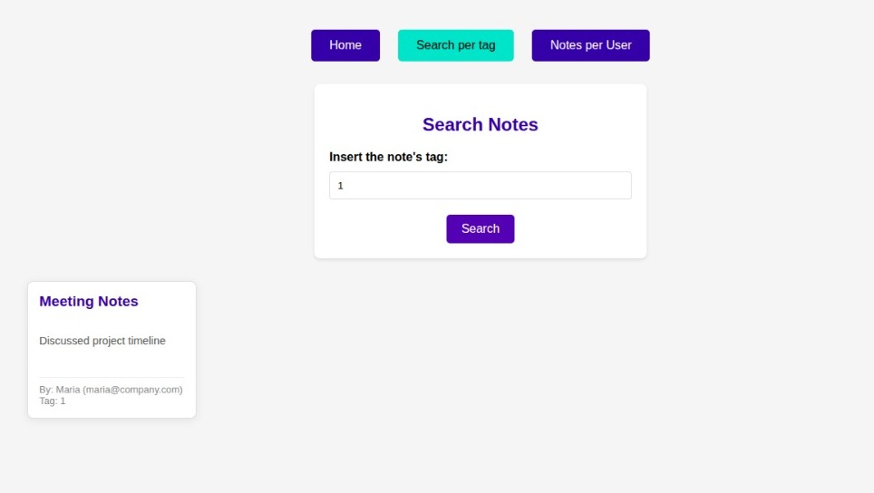

# Public Notes: A Multi-Tier Cloud Application with Docker and Kubernetes

     

## How to install and run the project can be found below! 

## Introduction

### Project Synopsis

This repository contains the source code and deployment configurations for "Public Notes," a full-stack, containerized web application designed for creating and managing public notes. This project serves as a comprehensive, hands-on demonstration of cloud computing principles, DevOps methodologies, and best practices in application deployment. It showcases the entire lifecycle of a cloud-native application, from local containerized development to scalable orchestration in a production-simulated environment.

### Academic Context
<table>
  <tr>
    <td valign="top" width="300">
      
    </td>
    <td valign="middle">
      This project is a key deliverable for the <b>Cloud Computing</b> discipline at the <b>Hochschule für angewandte Wissenschaften Hof</b>. It represents the practical application and synthesis of the core concepts covered throughout the course.
    </td>
  </tr>
</table>
The implementation of this project leverages a suite of industry-standard tools and technologies to build a robust and scalable system. Each component was selected to demonstrate a specific concept in cloud architecture:

* **Containerization (Docker):** The application and its dependencies are packaged into lightweight, portable containers using Docker. This ensures consistency across different environments and simplifies the deployment process.
* **Multi-Container Orchestration (Docker Compose):** For local development and testing, Docker Compose is used to define and manage the multi-container application, including its services, networks, and volumes, through a single declarative YAML file.
* **Cluster Orchestration (Kubernetes):** To simulate a production-grade deployment, the application is deployed to a Kubernetes cluster managed by Minikube. This demonstrates proficiency in scalable container orchestration, service discovery, and lifecycle management.
* **Load Balancing & Reverse Proxy (HAProxy):** HAProxy serves as the single entry point for all incoming traffic, providing reverse proxy capabilities to secure and decouple the backend services from the public internet.
* **Application Backend (Python/Flask):** The core application logic is built using Python with the Flask micro-framework, handling web requests, business logic, and communication with the data layer.
* **Data Persistence (PostgreSQL):** A PostgreSQL database is used for the persistent storage of application data. The use of Docker volumes ensures that data integrity is maintained even if the database container is recreated.

### Project Requirements

The development of this application was guided by a formal set of technical objectives designed to showcase a comprehensive understanding of cloud infrastructure design. The primary requirements were as follows:

* **Objective 1: Multi-Tier Architecture:** Design and implement a classic two-tier application architecture, a web application server (logic tier and presentation tier), and a database server (data tier).
* **Objective 2: Containerization:** Encapsulate each architectural tier (HAProxy, Web Application, PostgreSQL Database) into its own portable and isolated Docker container, enabling modularity.
* **Objective 3: Secure Networking:** Implement a secure network topology using isolated Docker networks. The design must ensure that the web server and database communicate on a private, backend network that is completely inaccessible from the public-facing load balancer network.
* **Objective 4: External Accessibility:** Expose the application to the host machine and the public exclusively through the load balancer's standard web port (port 80), hiding the internal services and ports.
* **Objective 5: Deployment Automation:** Utilize Docker Compose to define, build, and run the entire multi-container infrastructure. This allows for the entire application stack to be launched with a single, reproducible command.
* **Objective 6: Scalable Deployment Simulation:** Replicate the complete infrastructure within a local Kubernetes cluster (using Minikube). This final step demonstrates the ability to transition the application from a local development setup to a scalable, production-ready orchestration platform.

---

## Architectural Design

### System Overview: A 3-Tier Model

The application is structured according to the time-tested three-tier architectural model, which separates concerns into logical and physical layers. This separation enhances maintainability, scalability, and security.

* **Presentation Tier (HAProxy):** This is the outermost layer and the sole entry point for all user traffic. It is implemented using an HAProxy container. Its primary responsibility is to act as a reverse proxy, receiving incoming HTTP requests and forwarding them to the application tier. This layer insulates the internal system from direct external exposure.
* **Logic/Application Tier (Python/Flask):** This middle tier contains the core business logic of the application. The Python Flask server processes requests forwarded by the presentation tier, executes application logic (e.g., creating, deleting, or searching for notes), and interacts with the data tier to persist and retrieve information.
* **Data Tier (PostgreSQL):** The innermost tier is responsible for all aspects of data storage and management. It consists of a PostgreSQL database running in its own container. This tier is completely isolated and only accepts connections from the trusted application tier, ensuring the security and integrity of the application's data.

### The Secure Networking Strategy

A cornerstone of this project's architecture is its secure networking topology, which is implemented using a dual-network design within Docker Compose. This approach is a practical application of the **defense-in-depth** security principle, creating multiple layers of protection around the most sensitive asset: the database.

* **`frontend-network`:** This network connects the public-facing HAProxy container to the Flask web application container. It acts as a semi-trusted zone where the load balancer can forward legitimate user traffic to the application server.
* **`backend-network`:** This is a completely isolated, private network that connects *only* the Flask web application container to the PostgreSQL database container.

The security implications of this design are significant. The database container has **no network route** to the outside world and is not attached to the `frontend-network`. Therefore, an attacker cannot connect to the database directly. This multi-step requirement dramatically reduces the application's **attack surface** and makes a successful breach significantly more difficult, demonstrating a mature approach to cloud security.

---

## Application Showcase

The following images demonstrate the core functionalities of the Public Notes application.

<div align="center">

### Main User Interface


**Caption:** The main dashboard provides a consolidated view of all existing notes and serves as the central hub for accessing other features.

---

### Creating a New Note


**Caption:** Easily add new notes through a simple and intuitive interface.

---

### Deleting a Note


**Caption:** The application provides a straightforward mechanism for removing notes from the database.

---

### Filtering Notes by Tag



**Caption:** A search function allows users to filter the notes based on tags, making it easy to find relevant information quickly.

---

### Filtering Notes by User


**Caption:** For multi-user contexts, notes can be filtered by the creator's email address, allowing for personalized views of the data.

</div>

---
---
---
 
## Getting Started: A Comprehensive Guide

This section provides detailed, step-by-step instructions for cloning the repository, setting up the necessary environment, and deploying the application.

### Prerequisites

Before you begin, ensure you have the following software installed on your system. It is highly recommended to follow the official installation guides for each tool.

* **Git**
* **Docker Engine & Docker Compose**  
* **Minikube**
* **kubectl**

### Initial Project Setup

1.  **Clone the repository:**
    ```bash
    git clone https://github.com/LucasDuarte026/cloud_computing.git
    ```

2.  **Navigate to the project directory:**
    ```bash
    cd cloud_computing/project/public-notes
    ```

##  Deployment Instructions

### Deployment Option A: Docker Compose 

This method uses the `docker-compose.yml` file to automatically build images, configure networks, and launch all services.

**Execution Steps:**

1.  **Build and Launch:**
    From the `project/public-notes` directory, run the following commands.
    ```bash
    docker compose build
    docker compose up -d
    ```

2.  **Access the Application:**
    Open your browser and navigate to `http://localhost`.

<div align="center">


***Caption**: Example output after successfully launching the application with Docker Compose.*

</div>
 
---
### Deployment Option B: Kubernetes with Minikube
This deployment method demonstrates how to run the application in a local Kubernetes cluster, simulating a production-grade, scalable environment. This approach transitions the application from a simple multi-container setup to a powerful orchestration platform. All necessary Kubernetes manifest files are located in the `k8s/` directory.

**Prerequisites & Setup:**

1.  **Install Kubernetes Tools:**
    If you haven't already, install Minikube (for a local cluster) and kubectl (the command-line tool for interacting with the cluster).
    * **Minikube:** [https://minikube.sigs.k8s.io/docs/start/](https://minikube.sigs.k8s.io/docs/start/)
    * **kubectl:** [https://kubernetes.io/docs/tasks/tools/install-kubectl/](https://kubernetes.io/docs/tasks/tools/install-kubectl/)

 

3.  **Set Docker Environment:**
    To allow your local machine to build Docker images directly within Minikube's environment, run the following command. This crucial step enables the cluster to find the locally built images without needing an external container registry.
    ```bash
    # For Linux/macOS
    eval $(minikube -p minikube docker-env)

    # For Windows PowerShell
    # & minikube -p minikube docker-env | Invoke-Expression
    ```
    *__Note:__ You must run this command in the same terminal session you'll use for the next steps.*

**Execution Steps:**

1.  **Apply Kubernetes Manifests:**
    Navigate to the root project directory (`project/public-notes`) and use run the scrip file inside it to configurate all needed to run with minikube. These files define the deployments, services, persistent volumes, and secrets required to run the application on Kubernetes.
    ```bash
    bash ./kubernetes/launch_config.sh
    ```
    This single command orchestrates the creation of all necessary Kubernetes resources.

2.  **Verify the Deployment:**
    Check the status of your pods and services to ensure everything is running correctly. It may take a minute or two for all containers to start.
    ```bash
    kubectl get pods
    kubectl get services
    ```
    You should see pods for **haproxy**, the **flask-app**, and **postgres** in the `Running` state.

  
3.  **Access the Application:**
    To access the application, use the `minikube service` command. This command automatically creates a network tunnel to the `haproxy-service` within the cluster and opens the application's URL in your default web browser.
    ```bash
    minikube service haproxy
    ```

<div align="center">


***Caption**: Verifying the successful deployment of pods within the Minikube cluster.*

</div>
    
---

## Conclusion

This project successfully fulfills all its objectives, from creating a multi-tier architecture to deploying it on two distinct, industry-standard platforms: **Docker Compose** and **Kubernetes**. It serves as a practical, hands-on guide that bridges the gap between local development and cloud-native orchestration. The secure networking strategy and automated deployment scripts demonstrate key DevOps and cloud security principles, providing a solid foundation for building and managing modern, scalable web applications.
